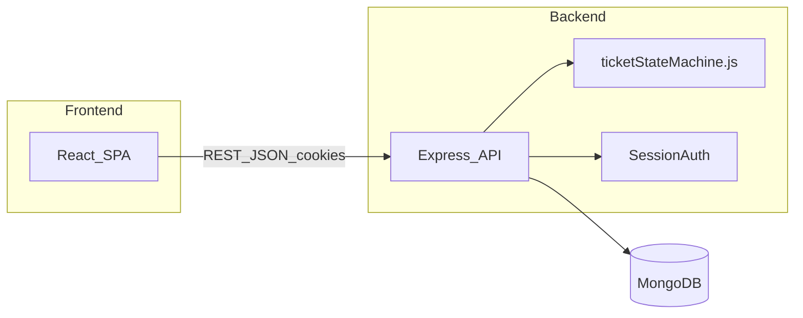

# Candidate Information — Support Ticket Management System

## Metadata

| Field | Value |
|-------|-------|
| **Name** | Prashant Baliyan |
| **Role** | Full-Stack Developer |
| **Primary IDE** | Cursor (AI-assisted development) |
| **Project Type** | Mini full-stack assessment — Support Ticket Management System |
| **Stack** | React 18, Vite 6, React Router 7, Node.js 18+, Express 4, Mongoose 8, MongoDB |
| **Auth Model** | Session-based (`express-session` + `bcrypt`) |
| **Test Stack** | Vitest, Supertest, mongodb-memory-server, React Testing Library |
| **Repository** | `js_ai_assignment` — monorepo with independent `frontend/` and `backend/` packages |

---

## Project Summary

This project is a **Support Ticket Management System** for internal support teams. Authenticated users (admins and agents) log in via a session cookie, then manage support tickets through their full lifecycle: creation, listing with search and filters, detail viewing, field updates, reassignment, status progression, and threaded comments.

The system's defining technical constraint is a **backend-enforced ticket state machine**. Status transitions are not free-form edits — they follow a strict directed graph (`open` → `in_progress` → `resolved` → `closed`, with `cancelled` as an alternate exit from active states). Invalid transitions return HTTP `409 Conflict` with machine-readable `allowedTransitions` metadata so the UI can guide users.

Data is persisted in **MongoDB** via **Mongoose** schemas for three entities:

- **User** — seeded credentials for `admin` and `agent` roles; referenced as `createdBy` and `assignedTo` on tickets
- **Ticket** — core lifecycle entity with title, description, priority, status, assignee, and audit timestamps
- **Comment** — append-only messages linked to tickets via `ticketId`, stored in a separate collection

The frontend is a React SPA that communicates with the REST API using native `fetch` with `credentials: 'include'` for cookie-based sessions. The ticket list implements debounced keyword search, status/priority filters, and infinite scroll pagination (10 tickets per page).



---

## Tools Used

| Category | Tool | Purpose |
|----------|------|---------|
| AI Development | **Cursor** | Spec-driven implementation, code review, test generation, debugging |
| Runtime | **Node.js 18+** | Backend server and tooling |
| Frontend Framework | **React 18** | Component-based UI |
| Build Tool | **Vite 6** | Dev server (port 5173) and production bundling |
| Routing | **React Router 7** | Client-side navigation (`/login`, `/`, `/tickets/new`, `/tickets/:id`) |
| Backend Framework | **Express 4** | REST API server (port 3001) |
| ODM | **Mongoose 8** | Schema modeling, validation, MongoDB queries |
| Database | **MongoDB** | Document persistence (local via Docker Compose or Atlas) |
| Validation | **express-validator** | Route-level request validation with centralized error formatting |
| Authentication | **express-session** + **bcrypt** | Cookie sessions and password hashing |
| HTTP Client | **Native fetch** | Frontend API calls with session credentials |
| Integration Testing | **Vitest** + **Supertest** | API and state-machine test suites |
| Test Database | **mongodb-memory-server** | Isolated in-memory MongoDB for CI-safe tests |
| Local Infrastructure | **Docker Compose** | One-command MongoDB for development |
| Version Control | **Git** | Source control with `.gitignore` excluding secrets |

---

## Setup Summary

### Prerequisites

- Node.js 18 or later
- MongoDB (local via Docker Compose or a remote Atlas URI)
- npm (bundled with Node.js)

### 1. Start MongoDB

```bash
docker compose up -d
```

This starts a MongoDB instance with a persistent volume for local development.

### 2. Backend

```bash
cd backend
cp .env.example .env
npm install
npm run seed
npm run dev
```

The API listens at `http://localhost:3001`. Configure `MONGODB_URI`, `SESSION_SECRET`, and seed credentials in `backend/.env` (see `.env.example` for required keys).

### 3. Frontend

```bash
cd frontend
cp .env.example .env
npm install
npm run dev
```

The app runs at `http://localhost:5173`. The API base URL defaults to `http://localhost:3001/api/v1` via `VITE_API_BASE_URL`.

### 4. Default Seed Users

After running `npm run seed`, log in with credentials configured in `backend/.env`:

| Role | Email | Password |
|------|-------|----------|
| Admin | `admin@example.com` | Value of `SEED_ADMIN_PASSWORD` in `.env` |
| Agent | `agent@example.com` | Value of `SEED_AGENT_PASSWORD` in `.env` |

The seed script also creates 15 sample tickets with varied statuses and priorities, plus comments on at least one ticket, to support list filtering and infinite-scroll testing.

### 5. Run Tests

```bash
cd backend && npm test
cd frontend && npm test
```

Backend integration tests are the mandatory verification gate for the ticket state machine (`stateMachine.test.js`, `tickets.test.js`, `comments.test.js`).

---

## Documentation Index

| Document | Purpose |
|----------|---------|
| [requirements-analysis.md](./requirements-analysis.md) | Domain model, functional/non-functional requirements, assumptions, edge cases |
| [acceptance-criteria.md](./acceptance-criteria.md) | Actionable definitions of done with verification checkboxes |
| [implementation-plan.md](./implementation-plan.md) | Milestone execution strategy and AI usage plan |
| [api-contract.md](./api-contract.md) | REST API schemas, validation rules, and error responses |
| [README.md](./README.md) | Quick-start commands and project structure |
| [tool-specific/cursor-workflow/](./tool-specific/cursor-workflow/) | Supplementary spec-driven workflow history |

---

## Architecture Notes

- **API base path:** `/api/v1` — all ticket and user endpoints require an authenticated session except `POST /api/v1/auth/login`.
- **State machine module:** `backend/src/services/ticketStateMachine.js` — single source of truth for allowed transitions; exported functions used by route handlers and returned in `meta.allowedTransitions`.
- **Response envelope:** `{ data: T }` or `{ data: T, meta: { ... } }` — errors use `{ error: string, details?: object }`.
- **Comment storage:** Comments live in a top-level `comments` collection (not embedded in ticket documents) but are joined and returned on ticket detail responses.
