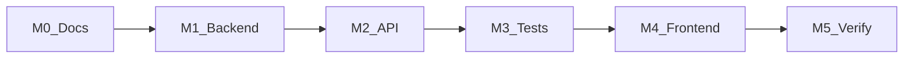

# Implementation Plan — Support Ticket Management System

Iterative execution strategy across discrete milestones, with an explicit AI usage plan for spec-driven development in Cursor.

**Related documents:**

- [candidate-info.md](../tool-specific/cursor-workflow/candidate-info.md) — project metadata and setup
- [requirements-analysis.md](./requirements-analysis.md) — domain and requirements
- [acceptance-criteria.md](../tool-specific/cursor-workflow/acceptance-criteria.md) — definitions of done
- [api-contract.md](./api-contract.md) — REST API contract

---

## Execution Strategy

Development follows a **spec-first, milestone-gated** approach. Each milestone has a clear deliverable and verification gate before proceeding. Backend state machine logic and integration tests are prioritized before frontend UI work to ensure the API contract is stable.

---

## Milestone 0 — Documentation and Repository Hygiene

**Goal:** Establish evaluation documentation baseline and secure repository configuration.

**Status:** Complete

### Deliverables

- [x] Evaluation docs: `tool-specific/cursor-workflow/candidate-info.md`, `implementation-workflow/` (requirements, plan, API contract, test strategy, review, reflection, PR)
- [x] Merged `acceptance-criteria.md` in `tool-specific/cursor-workflow/`
- [x] Root `.gitignore` excluding `.env`, `node_modules/`, `dist/`, `coverage/`
- [x] `backend/.env.example` and `frontend/.env.example` with placeholder keys
- [x] Supplementary workflow docs in `tool-specific/cursor-workflow/`
- [x] README updated with Evaluation Documentation section

### Verification Gate

- All 5 root markdown files exist with no placeholder tokens
- Cross-links between docs are valid
- No secrets in tracked files

---

## Milestone 1 — Backend Foundation

**Goal:** MongoDB connection, Mongoose models, seed script, Express scaffold.

**Status:** Complete

### Deliverables

- [x] `backend/package.json` with Express, Mongoose, bcrypt, express-session, cors, dotenv, express-validator
- [x] `backend/src/config/db.js` — MongoDB connection via `MONGODB_URI`
- [x] `backend/src/models/User.js` — roles enum, password hashing, email uniqueness
- [x] `backend/src/models/Ticket.js` — priority/status enums, text index, population refs
- [x] `backend/src/models/Comment.js` — separate collection with `ticketId` reference
- [x] `backend/src/models/index.js` — model exports
- [x] `backend/src/app.js` and `backend/src/server.js` — Express app skeleton
- [x] `docker-compose.yml` — local MongoDB with persistent volume
- [x] `backend/src/scripts/seed.js` — idempotent user upsert, 15 sample tickets, comments

### Verification Gate

- `npm run seed` creates users and tickets without duplication on re-run
- `npm run dev` starts server on port 3001
- `GET /health` returns `{ status: "ok" }`

---

## Milestone 2 — API Routes and State Machine

**Goal:** Full REST API with centralized validation, session auth, and backend-enforced state machine.

**Status:** Complete

### Deliverables

- [x] `backend/src/middleware/auth.js` — `requireAuth` session guard
- [x] `backend/src/middleware/validate.js` — `handleValidation` + global `errorHandler`
- [x] `backend/src/services/ticketStateMachine.js` — transition map, `assertValidTransition`, `getAllowedTransitions`
- [x] `backend/src/routes/auth.routes.js` — login, logout, me
- [x] `backend/src/routes/users.routes.js` — user list for assignee dropdown
- [x] `backend/src/routes/tickets.routes.js` — CRUD, status endpoint, comments
- [x] Routes mounted at `/api/v1` in `app.js`

### Key Design Decisions

| Decision | Rationale |
|----------|-----------|
| Separate `PATCH /tickets/:id/status` endpoint | Isolates state machine logic; prevents status smuggling via generic PATCH |
| `409` for invalid transitions (not `400`) | Distinguishes validation errors from business rule conflicts |
| `meta.allowedTransitions` in detail/status responses | Enables UI to render only valid next-status buttons |
| Comments in separate collection | Avoids document size growth; supports indexed queries by `ticketId` |

### Verification Gate

- Manual API testing with curl or Postman for all endpoints
- State machine rejects invalid transitions with `409` and `allowedTransitions`

---

## Milestone 3 — Integration Tests

**Goal:** Automated test coverage for API, state machine, and comments — mandatory verification gate.

**Status:** Complete

### Deliverables

- [x] `backend/vitest.config.js` — test runner configuration
- [x] `backend/tests/setup.js` — mongodb-memory-server lifecycle, collection cleanup
- [x] `backend/tests/helpers.js` — `createUser`, `login`, `createTicket`, `setTicketStatus`
- [x] `backend/tests/integration/tickets.test.js` — auth, CRUD, filters, pagination, validation
- [x] `backend/tests/integration/stateMachine.test.js` — full transition matrix (allowed + rejected)
- [x] `backend/tests/integration/comments.test.js` — comment creation and validation

### Verification Gate

- `cd backend && npm test` exits with code 0
- All transition matrix entries from [requirements-analysis.md](./requirements-analysis.md) covered

---

## Milestone 4 — Frontend Application

**Goal:** React SPA with auth, ticket list (search/filter/infinite scroll), create, and detail pages.

**Status:** Complete

### Deliverables

- [x] `frontend/package.json` — React 18, Vite 6, React Router 7, Vitest
- [x] `frontend/src/api/client.js` — fetch wrapper with `credentials: 'include'`, `ApiError` class
- [x] `frontend/src/context/AuthContext.jsx` — session user state
- [x] `frontend/src/components/ProtectedRoute.jsx` — auth guard
- [x] `frontend/src/components/StatusBadge.jsx`, `PriorityBadge.jsx`, `ErrorAlert.jsx`
- [x] `frontend/src/pages/LoginPage.jsx` — login form with seed credential hints
- [x] `frontend/src/pages/TicketListPage.jsx` — debounced search, filters, infinite scroll
- [x] `frontend/src/pages/CreateTicketPage.jsx` — create form with validation feedback
- [x] `frontend/src/pages/TicketDetailPage.jsx` — edit, status transitions, comments
- [x] `frontend/src/App.jsx` — route configuration

### Verification Gate

- Full manual walkthrough: login → list → create → detail → edit → transition → comment → logout
- UI renders only `meta.allowedTransitions` buttons
- Error messages from API displayed via `ErrorAlert`

---

## Milestone 5 — Verification and Polish

**Goal:** Full acceptance criteria walkthrough, remaining tests, documentation alignment.

**Status:** Partial

### Deliverables

- [x] Backend integration tests pass (`npm test`)
- [x] Root evaluation documentation complete
- [ ] Full walkthrough of all items in [acceptance-criteria.md](../tool-specific/cursor-workflow/acceptance-criteria.md)
- [ ] Manual persistence test (restart backend + MongoDB, verify data intact)
- [ ] Frontend page tests (`TicketListPage.test.jsx`, `CreateTicketPage.test.jsx`) — optional enhancement
- [ ] Secret scan (`git grep` for passwords, API keys, session secrets)

### Verification Gate

- All checkboxes in [acceptance-criteria.md](../tool-specific/cursor-workflow/acceptance-criteria.md) Definition of Done marked complete
- No secrets in git history

---

## AI Usage Plan

This section documents how Cursor AI is used throughout the development lifecycle for review, testing, and debugging.

### 1. Spec-First Prompting

**When:** Before writing any code for a new feature or endpoint.

**Approach:**

- Reference [api-contract.md](./api-contract.md) and [requirements-analysis.md](./requirements-analysis.md) in prompts
- Instruct Cursor to implement route handlers that match the documented request/response schemas exactly
- For state machine changes, paste the transition table and require `ticketStateMachine.js` as the single enforcement point

**Example prompt:**

> Implement `PATCH /api/v1/tickets/:id/status` per api-contract.md. Use `assertValidTransition` from ticketStateMachine.js. Return 409 with details.allowedTransitions on invalid transitions. Do not accept status changes on the generic PATCH endpoint.

### 2. Review Prompts

**When:** After implementing a feature or before merging changes.

**Approach:**

- Ask Cursor to compare route handler implementations against [api-contract.md](./api-contract.md)
- Request verification that error status codes match the contract (400 vs 409 vs 404)
- Use Bugbot subagent for automated diff review of changed files
- Use Security Review subagent for auth, session, and input validation checks

**Example prompt:**

> Review backend/src/routes/tickets.routes.js against api-contract.md. List any mismatches in status codes, error messages, or response shapes.

### 3. Testing Prompts

**When:** After implementing API endpoints or state machine logic.

**Approach:**

- Generate integration tests from the transition matrix in [requirements-analysis.md](./requirements-analysis.md)
- Run `cd backend && npm test` after each milestone completion
- Ask Cursor to add test cases for edge cases (terminal status, status smuggling, invalid assignee)
- Use `backend/tests/helpers.js` patterns for consistent test setup

**Example prompt:**

> Write integration tests in stateMachine.test.js for all rejected transitions listed in requirements-analysis.md EC-5. Each test must assert 409 status and details.allowedTransitions array.

### 4. Debugging Prompts

**When:** Encountering unexpected API behavior, test failures, or UI errors.

**Approach:**

- Paste the full `409` response body including `details` when debugging transition failures
- Share the failing test output and ask Cursor to trace the route handler → state machine → Mongoose save chain
- Document spec deviations in `tool-specific/cursor-workflow/debugging-notes.md`
- For frontend issues, share the network tab response and the component's error handling path

**Example prompt:**

> Test "rejects open → resolved" fails with 200 instead of 409. Here is the test code and the route handler. Find why assertValidTransition is not being called.

### 5. Guardrails

Follow [tool-specific/cursor-workflow/cursor-rules-or-instructions.md](./tool-specific/cursor-workflow/cursor-rules-or-instructions.md):

| Rule | Application |
|------|-------------|
| No secrets in code | All credentials in `.env`; `.env.example` has placeholders only |
| Minimal diffs | Change only files required for the current milestone |
| Update docs when behavior changes | If API changes, update `api-contract.md` first |
| No new dependencies without justification | Prefer existing stack (express-validator, not Joi) |
| Follow existing patterns | Match naming, folder structure, error handling in surrounding code |
| Tests for behavior changes | Any new endpoint or transition rule gets an integration test |

### 6. Documentation Prompts

**When:** Creating or updating evaluation documentation.

**Approach:**

- Generate docs from the actual implemented code, not aspirational designs
- Cross-reference between the 5 root docs for traceability
- Include real enum values, error messages, and file paths from the codebase
- No placeholder tokens — every section fully populated

---

## Risk Register

| Risk | Impact | Mitigation |
|------|--------|------------|
| API contract drift from implementation | Evaluator confusion, test failures | `api-contract.md` verified against route handlers; update docs before code |
| Race conditions on concurrent transitions | Incorrect ticket status | Documented in EC-1; acceptable for mini-project; future: optimistic locking |
| Missing frontend tests | UI regressions undetected | Backend integration tests are primary gate; frontend tests are stretch goal |
| Secrets accidentally committed | Security violation | `.gitignore` + pre-commit review + `git grep` in M5 |
| State machine bypass via generic PATCH | Business rule violation | Explicit 400 rejection tested in `stateMachine.test.js` |

---

## Milestone Summary

| Milestone | Scope | Status |
|-----------|-------|--------|
| M0 — Documentation & hygiene | Root eval docs, `.gitignore`, `.env.example` | Done |
| M1 — Backend foundation | Models, DB config, seed, Express scaffold | Done |
| M2 — API + state machine | Routes, `ticketStateMachine.js`, validation middleware | Done |
| M3 — Integration tests | tickets, stateMachine, comments test suites | Done |
| M4 — Frontend | Auth, list/create/detail pages, API client | Done |
| M5 — Verification | Full acceptance walkthrough, remaining frontend tests | Partial |
