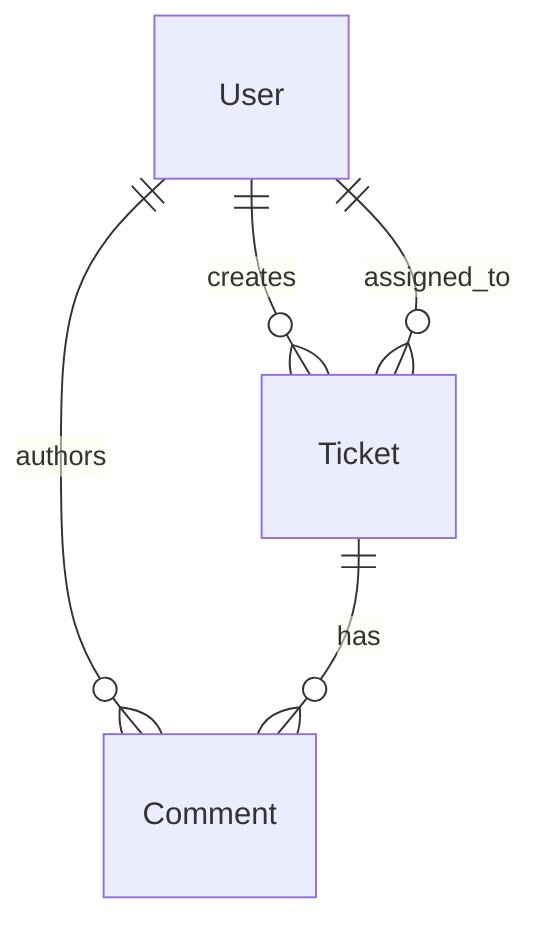
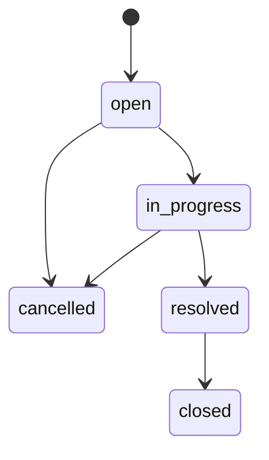

# Requirements Analysis — Support Ticket Management System

## Overview

This document captures our understanding of the multi-entity domain, functional and non-functional requirements, explicit assumptions, and deep edge cases for the MongoDB-backed Support Ticket Management System with a backend-enforced ticket state machine.

**Related documents:**

- [submission-index.md](../tool-specific/cursor-workflow/submission-index.md) — assessor entry point
- [tool-workflow.md](../tool-specific/cursor-workflow/tool-workflow.md) — narrative AI workflow
- [candidate-info.md](../tool-specific/cursor-workflow/candidate-info.md) — project metadata and setup
- [api-contract.md](./api-contract.md) — REST API schemas and error responses
- [acceptance-criteria.md](../tool-specific/cursor-workflow/acceptance-criteria.md) — definitions of done

---

## Multi-Entity Domain Model

The system models three primary entities stored as MongoDB collections, linked by ObjectId references and enforced through Mongoose schemas.

### User

Internal support staff who authenticate and interact with tickets. Users are **pre-seeded** — there is no registration or user-management UI.

| Field | Type | Constraints |
|-------|------|-------------|
| `id` | ObjectId | Exposed as `id` in JSON (not `_id`) |
| `name` | String | Required, trimmed, 1–100 characters |
| `email` | String | Required, unique, lowercase, valid email format |
| `role` | String | Enum: `admin`, `agent` |
| `passwordHash` | String | Bcrypt hash; never returned in API responses |
| `createdAt`, `updatedAt` | Date | Auto-managed timestamps |

**Relationships:**

- Referenced as `createdBy` on tickets and comments (who created the record)
- Referenced as `assignedTo` on tickets (optional assignee for workload routing)

### Ticket

The core lifecycle entity representing a support request progressing through defined statuses.

| Field | Type | Constraints |
|-------|------|-------------|
| `id` | ObjectId | Exposed as `id` in JSON |
| `title` | String | Required, 3–200 characters |
| `description` | String | Required, 10–5000 characters |
| `priority` | String | Enum: `low`, `medium`, `high`, `critical`; default `medium` |
| `status` | String | Enum: `open`, `in_progress`, `resolved`, `closed`, `cancelled`; default `open` |
| `assignedTo` | ObjectId → User | Optional, nullable; populated in API responses |
| `createdBy` | ObjectId → User | Required; set from authenticated session on create |
| `createdAt`, `updatedAt` | Date | Auto-managed timestamps |

**Indexes:** Text index on `title` and `description` for keyword search.

### Comment

Append-only messages attached to tickets, stored in a separate collection (not embedded subdocuments).

| Field | Type | Constraints |
|-------|------|-------------|
| `id` | ObjectId | Exposed as `id` in JSON |
| `ticketId` | ObjectId → Ticket | Required, indexed |
| `message` | String | Required, 1–2000 characters |
| `createdBy` | ObjectId → User | Required; set from authenticated session |
| `createdAt` | Date | Immutable after creation (`updatedAt` disabled) |

### Entity Relationship Diagram

---

## Status State Machine

Status transitions are enforced exclusively in the backend via `backend/src/services/ticketStateMachine.js`. The generic ticket update endpoint (`PATCH /api/v1/tickets/:id`) **must not** accept status changes.

### Allowed Transitions

| Current Status | Allowed Next Statuses |
|----------------|----------------------|
| `open` | `in_progress`, `cancelled` |
| `in_progress` | `resolved`, `cancelled` |
| `resolved` | `closed` |
| `closed` | _(none — terminal)_ |
| `cancelled` | _(none — terminal)_ |

### Transition Diagram

New tickets always start with `status: "open"`. Status changes are requested via `PATCH /api/v1/tickets/:id/status` with a `{ "status": "..." }` body.

---

## Functional Requirements

### FR-1: Authentication

| ID | Requirement |
|----|-------------|
| FR-1.1 | Users authenticate via `POST /api/v1/auth/login` with email and password |
| FR-1.2 | Successful login establishes a server-side session (HTTP-only cookie) |
| FR-1.3 | `GET /api/v1/auth/me` returns the current authenticated user |
| FR-1.4 | `POST /api/v1/auth/logout` destroys the session |
| FR-1.5 | All ticket and user list endpoints require authentication (`401` if missing) |

### FR-2: Ticket CRUD

| ID | Requirement |
|----|-------------|
| FR-2.1 | **Create:** `POST /api/v1/tickets` — title, description, optional priority and assignee; always created as `open` |
| FR-2.2 | **List:** `GET /api/v1/tickets` — paginated list with keyword search (`q`), status filter, priority filter |
| FR-2.3 | **Read:** `GET /api/v1/tickets/:id` — single ticket with populated users, comments, and `meta.allowedTransitions` |
| FR-2.4 | **Update:** `PATCH /api/v1/tickets/:id` — update title, description, priority, assignee; **not** status |

### FR-3: State Transitions

| ID | Requirement |
|----|-------------|
| FR-3.1 | Status changes via `PATCH /api/v1/tickets/:id/status` only |
| FR-3.2 | Valid transitions succeed with `200` and updated ticket |
| FR-3.3 | Invalid transitions return `409` with `details.allowedTransitions` |
| FR-3.4 | Attempts to set `status` on generic PATCH return `400` with redirect message |
| FR-3.5 | UI renders only buttons for `meta.allowedTransitions` |

### FR-4: Comments

| ID | Requirement |
|----|-------------|
| FR-4.1 | `POST /api/v1/tickets/:id/comments` appends a comment to a ticket |
| FR-4.2 | `createdBy` is set from the authenticated session, not the request body |
| FR-4.3 | Response returns the full ticket object including updated `comments` array |
| FR-4.4 | Comments are ordered by `createdAt` ascending (oldest first) |

### FR-5: User Listing

| ID | Requirement |
|----|-------------|
| FR-5.1 | `GET /api/v1/users` returns all users (`id`, `name`, `email`, `role`) for assignee dropdown |

### FR-6: Frontend Flows

| ID | Requirement |
|----|-------------|
| FR-6.1 | Login page with redirect to ticket list on success |
| FR-6.2 | Ticket list with debounced search, status/priority filters, infinite scroll (10 per page) |
| FR-6.3 | Create ticket form with validation feedback |
| FR-6.4 | Ticket detail with inline edit, status transition buttons, comment thread |
| FR-6.5 | Protected routes redirect unauthenticated users to `/login` |

---

## Non-Functional Requirements

### NFR-1: Persistence

- All tickets, comments, and users are stored in MongoDB — not in-memory structures
- Data survives backend server restarts and MongoDB container restarts (Docker volume persistence)
- Seed script is idempotent (upsert users by email; safe to re-run)

### NFR-2: Performance and Scalability

- Ticket list queries use pagination (`page`, `limit`) with default `limit=10` and max `limit=100`
- List endpoint sorts by `updatedAt` descending (most recently updated first)
- Keyword search uses case-insensitive regex on `title` and `description` (acceptable for mini-project scale; text index available for future optimization)
- `Promise.all` for parallel count + fetch on list queries

### NFR-3: Validation and Data Integrity

- Dual-layer validation: `express-validator` at route level + Mongoose schema constraints
- Invalid enum values, missing required fields, and out-of-range strings rejected with `400`
- Assignee existence verified before save (malformed ObjectId or missing user → `400`)
- State machine enforces business rules independent of client input

### NFR-4: Security

- Passwords hashed with bcrypt (cost factor 10); `passwordHash` never exposed in API
- Session secret and database URI stored in `.env` files (never committed)
- CORS configured for frontend origin with credentials support
- No `eval`, no unsafe deserialization, no hardcoded secrets in source

### NFR-5: Error Handling

- Consistent error envelope: `{ error: string, details?: object }`
- Validation errors include `details.fields` with per-field messages
- State machine conflicts use `409` (not `400`) with transition metadata
- Global error handler masks internal `500` messages outside `development` environment

### NFR-6: Testability

- Integration tests run against isolated `mongodb-memory-server` instance
- State machine transition matrix covered by mandatory automated tests
- Test helpers (`createUser`, `login`, `createTicket`, `setTicketStatus`) in `backend/tests/helpers.js`

---

## Assumptions

| ID | Assumption | Rationale |
|----|------------|-----------|
| A-1 | **Users are pre-seeded** via `backend/src/scripts/seed.js` | No registration UI required; evaluators use known credentials from `.env.example` |
| A-2 | **Single-tenant internal tool** | No multi-org isolation, no per-tenant data partitioning |
| A-3 | **Binary auth model** | Authenticated vs unauthenticated only; no role-based endpoint restrictions (both `admin` and `agent` have equal ticket access) |
| A-4 | **Status changes are never accepted on generic PATCH** | Enforces separation of concerns; state machine logic lives in one module and one endpoint |
| A-5 | **Frontend uses infinite scroll** | List loads 10 tickets per page via `IntersectionObserver`; not traditional page-number pagination UI |
| A-6 | **Comments are append-only** | No edit or delete comment endpoints; simplifies audit trail |
| A-7 | **Last-write-wins for concurrent updates** | No optimistic locking or versioning on tickets; acceptable for mini-project concurrency model |
| A-8 | **API versioning via `/api/v1` prefix** | Allows future breaking changes without disrupting existing clients |

---

## Edge Cases

### EC-1: Concurrent Status Transitions (Race Condition)

**Scenario:** Two agents simultaneously attempt to transition the same ticket from `open` to different valid next states (e.g., Agent A → `in_progress`, Agent B → `cancelled`).

**Behavior:**

1. Both requests read the ticket with `status: "open"` before either saves
2. MongoDB's last-write-wins semantics apply — the second `save()` overwrites the first
3. If the second agent's transition is still valid from the **original** read status, it succeeds even though the ticket may have already moved
4. If an agent reads stale state and requests a transition invalid for the **current** DB state, `assertValidTransition` returns `409`

**Mitigation (future):** Optimistic concurrency with a `version` field or atomic `findOneAndUpdate` with status precondition. For this mini-project, integration tests verify single-threaded correctness; race conditions are documented but not fully prevented.

### EC-2: Terminal Status Immutability

**Scenario:** A user attempts any status change on a `closed` or `cancelled` ticket.

**Behavior:**

- `getAllowedTransitions("closed")` and `getAllowedTransitions("cancelled")` return `[]`
- `assertValidTransition` throws with `statusCode: 409` and message: `"Cannot change status. This ticket is Closed."` (or `Cancelled`)
- UI receives empty `meta.allowedTransitions` and renders no transition buttons

**Verification:** Covered in `backend/tests/integration/stateMachine.test.js` — transitions from terminal states to any status must fail with `409`.

### EC-3: Invalid Assignee Reference

**Scenario:** A create or update request includes `assignedTo` with a malformed ObjectId or a valid ObjectId that does not correspond to any user.

**Behavior:**

| Input | Status | Error |
|-------|--------|-------|
| `"not-a-valid-id"` | `400` | `{ "error": "Invalid assignedTo" }` |
| Valid ObjectId, no matching user | `400` | `{ "error": "Assigned user not found" }` |
| `null` | `200` | Clears assignee (unassigned ticket) |
| Omitted | — | Assignee unchanged (update) or `null` (create) |

**Rationale:** Prevents orphaned references and ensures assignee dropdown values always resolve to real users.

### EC-4: Status Smuggling via Generic PATCH

**Scenario:** A client sends `PATCH /api/v1/tickets/:id` with `{ "status": "resolved", "title": "Updated" }` attempting to bypass the state machine.

**Behavior:**

- Route handler checks `'status' in req.body` **before** applying any updates
- Returns `400` immediately: `{ "error": "Use PATCH /tickets/:id/status to change status" }`
- No fields are modified — the request is fully rejected

**Rationale:** Ensures all status changes flow through `ticketStateMachine.js` where transition rules are centrally enforced and tested.

### EC-5: Skipping Lifecycle Stages

**Scenario:** A client attempts `open` → `resolved` or `open` → `closed` directly.

**Behavior:**

- `isValidTransition("open", "resolved")` returns `false`
- Response: `409` with `details: { currentStatus: "open", requestedStatus: "resolved", allowedTransitions: ["in_progress", "cancelled"] }`
- Human-readable error: `"Cannot move from Open to Resolved. Allowed next steps: In Progress, Cancelled."`

**Verification:** Minimum 7 rejected transitions tested in `stateMachine.test.js`.

### EC-6: Empty or Partial Update Body

**Scenario:** `PATCH /api/v1/tickets/:id` sent with `{}` or no recognized fields.

**Behavior:** Returns `400` — `{ "error": "At least one field must be provided" }`. Prevents no-op PATCH requests that could mask client bugs.

### EC-7: Comment on Non-Existent Ticket

**Scenario:** `POST /api/v1/tickets/:id/comments` with a valid ObjectId format but no matching ticket document.

**Behavior:** Returns `404` — `{ "error": "Ticket not found" }`. Same behavior for malformed ticket IDs on any `:id` route.

---

## Requirements Traceability

| Requirement Area | Acceptance Criteria | API Contract | Integration Tests |
|------------------|--------------------|--------------|--------------------|
| Ticket CRUD | [acceptance-criteria.md](../tool-specific/cursor-workflow/acceptance-criteria.md) — AC-1–AC-5 | [api-contract.md](./api-contract.md) | `tickets.test.js` |
| State machine | [acceptance-criteria.md](../tool-specific/cursor-workflow/acceptance-criteria.md) — AC-6, Strict State Validation | `PATCH .../status` | `stateMachine.test.js` |
| Comments | [acceptance-criteria.md](../tool-specific/cursor-workflow/acceptance-criteria.md) — AC-5 | `POST .../comments` | `comments.test.js` |
| Error handling | [acceptance-criteria.md](../tool-specific/cursor-workflow/acceptance-criteria.md) — AC-9, Centralized Error Handling | Error response schemas | All test files |
| Persistence | [acceptance-criteria.md](../tool-specific/cursor-workflow/acceptance-criteria.md) — AC-8 | — | Manual verification |
