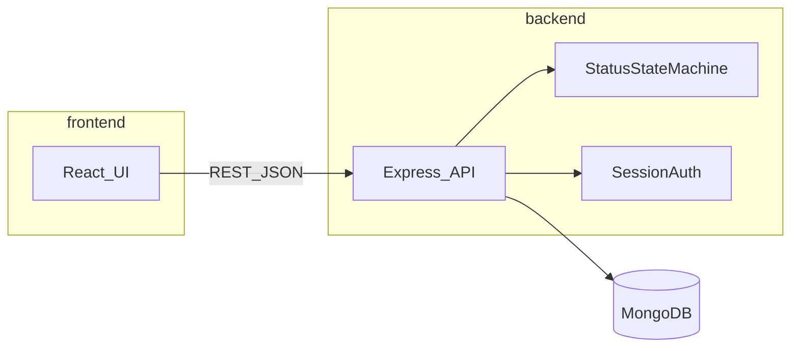

# Project Context — Support Ticket Management System

## Summary

This project is a **Support Ticket Management System** built as a mini fullstack application for an AI workflow capability assessment. Internal users authenticate via a simple session-based login, then create, view, update, comment on, search, and progress support tickets through a defined lifecycle enforced by a backend state machine.

All implementation MUST follow the spec-driven workflow documents in this folder:

- [spec.md](./spec.md) — canonical schemas, validation, API contract, state machine
- [tasks.md](./tasks.md) — phased implementation plan
- [acceptance-criteria.md](./acceptance-criteria.md) — definitions of done
- [cursor-rules-or-instructions.md](./cursor-rules-or-instructions.md) — AI coding guardrails

---

## Tech Stack

| Layer | Technology | Purpose |
|-------|------------|---------|
| Frontend | React 18+ | UI components and routing |
| Build tool | Vite | Fast dev server and production bundling |
| Routing | React Router | Client-side navigation |
| HTTP client | `fetch` (native) or `axios` | API communication with credentials |
| Frontend tests | Vitest + React Testing Library | Unit and component tests |
| Backend | Node.js + Express | REST API server |
| ODM | Mongoose | MongoDB schema modeling and validation |
| Request validation | `express-validator` (or equivalent) | Route-level input validation |
| Auth | `express-session` + `bcrypt` | Session-based login for internal users |
| Database | MongoDB | Persistent document storage |
| Integration tests | Vitest (or Jest) + Supertest | API and state-machine integration tests |
| Local DB (optional) | Docker Compose | Run MongoDB locally for development |

---

## Repository Layout

```
js_ai_assignment/
├── tool-specific/
│   └── cursor-workflow/       # Spec-driven workflow docs (this folder)
├── frontend/                  # Vite + React application
│   ├── package.json
│   ├── .env.example
│   └── src/
├── backend/                   # Node.js + Express API
│   ├── package.json
│   ├── .env.example
│   ├── src/
│   └── tests/
│       └── integration/
├── .gitignore                 # MUST exclude .env, node_modules, dist, coverage
└── README.md                  # Setup and run instructions (Phase 5)
```

- `frontend/` and `backend/` each have an independent `package.json`.
- Secrets and environment-specific values live in `.env` files that are **never committed**.
- Only `.env.example` files with placeholder values are committed.

---

## Architecture



### Request Flow

1. User logs in via `POST /api/v1/auth/login`; server creates a session cookie.
2. React sends authenticated requests with `credentials: 'include'`.
3. Express auth middleware validates the session on protected routes.
4. Ticket status changes go through the state machine service — never via generic field PATCH.
5. Mongoose persists documents to MongoDB; data survives process and server restarts.

---

## API Conventions

| Convention | Rule |
|------------|------|
| Base path | `/api/v1` |
| Format | JSON request and response bodies |
| Auth | Session cookie; protected routes return `401` when unauthenticated |
| Error shape | `{ "error": "Human-readable message", "details": {} }` — `details` optional |
| Success list | `{ "data": [...], "meta": { "total": N } }` or plain array — pick one and stay consistent |
| Success single | `{ "data": { ... } }` or plain object — match list convention |

### HTTP Status Codes

| Code | Usage |
|------|-------|
| `200` | Successful GET, PATCH, POST (non-create) |
| `201` | Resource created (ticket, comment) |
| `400` | Validation failure (missing/invalid fields) |
| `401` | Not authenticated |
| `404` | Ticket or user not found |
| `409` | Invalid status transition |
| `500` | Unexpected server error |

---

## Authentication

- **Model:** Session-based basic auth for internal users.
- **User storage:** `User` documents in MongoDB with bcrypt-hashed passwords (see [spec.md](./spec.md)).
- **Bootstrap:** Seed script creates an initial admin user from `SEED_ADMIN_EMAIL` and `SEED_ADMIN_PASSWORD` env vars (values in `.env` only).
- **Session:** `express-session` with `SESSION_SECRET` from environment; cookie `httpOnly`, `sameSite: 'lax'`.
- **CORS:** Backend allows `CLIENT_URL` origin with credentials.

---

## Environment Variables

### Backend (`backend/.env`)

| Variable | Required | Description |
|----------|----------|-------------|
| `MONGODB_URI` | Yes | MongoDB connection string |
| `SESSION_SECRET` | Yes | Random string for signing session cookies |
| `PORT` | No | API port (default `3001`) |
| `NODE_ENV` | No | `development` or `test` or `production` |
| `CLIENT_URL` | Yes | Frontend origin for CORS (e.g. `http://localhost:5173`) |
| `SEED_ADMIN_EMAIL` | No | Bootstrap admin email for seed script |
| `SEED_ADMIN_PASSWORD` | No | Bootstrap admin password for seed script |

### Frontend (`frontend/.env`)

| Variable | Required | Description |
|----------|----------|-------------|
| `VITE_API_BASE_URL` | Yes | Backend API base (e.g. `http://localhost:3001/api/v1`) |

### Test (`backend/.env.test` or test setup)

| Variable | Required | Description |
|----------|----------|-------------|
| `MONGODB_URI` | Yes | Separate test database URI |

**NEVER commit `.env`, `.env.local`, or `.env.test` files.**

---

## Development Commands (target)

```bash
# Backend
cd backend && npm install && npm run dev
cd backend && npm test

# Frontend
cd frontend && npm install && npm run dev
cd frontend && npm test

# Seed database
cd backend && npm run seed
```

---

## Key Design Principles

1. **Spec-first** — Schemas and state machine rules in [spec.md](./spec.md) are authoritative.
2. **Backend enforcement** — Validation and lifecycle rules are enforced server-side; UI reflects but does not own business rules.
3. **Persistence** — All tickets, comments, and users survive server and database restarts.
4. **No secrets in repo** — Use `.env.example` with placeholders only.
5. **Test the state machine** — Integration tests for every allowed and rejected status transition are mandatory.
