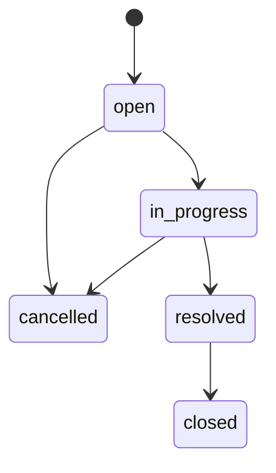

# Specification — Support Ticket Management System

This document is the **canonical source of truth** for data models, validation rules, API contracts, and the ticket status state machine. All backend and frontend code MUST conform to this spec. Changes to behavior require updating this file first.

Related documents:

- [project-context.md](./project-context.md) — stack and architecture
- [tasks.md](./tasks.md) — implementation phases
- [acceptance-criteria.md](./acceptance-criteria.md) — verification criteria

---

## Entities

### User

Seeded only — no user-management UI required. Used for authentication and references on tickets/comments.

| Field | API key | Type | Rules |
|-------|---------|------|-------|
| `id` | `id` | ObjectId | MongoDB `_id` exposed as `id` in JSON |
| `name` | `name` | `String` | **Required.** Trimmed. Min 1, max 100 characters. |
| `email` | `email` | `String` | **Required.** Unique. Lowercase. Valid email format. |
| `role` | `role` | `String` | **Required.** Enum: `admin`, `agent`. |
| `passwordHash` | — | `String` | **Internal only.** Bcrypt hash. Never returned in API. |
| `createdAt` | `createdAt` | `Date` | Auto-managed |
| `updatedAt` | `updatedAt` | `Date` | Auto-managed |

---

### Ticket

| Field | API key | Type | Rules |
|-------|---------|------|-------|
| `id` | `id` | ObjectId | Exposed as `id` in JSON |
| `title` | `title` | `String` | **Required.** Min 3, max 200 characters. |
| `description` | `description` | `String` | **Required.** Min 10, max 5000 characters. |
| `priority` | `priority` | `String` | Enum: `low`, `medium`, `high`, `critical`. Default: `medium`. |
| `status` | `status` | `String` | Enum: `open`, `in_progress`, `resolved`, `closed`, `cancelled`. Default: `open`. |
| `assignedTo` | `assignedTo` | ObjectId → User | Optional. Nullable. Populated with `id`, `name`, `email`, `role`. |
| `createdBy` | `createdBy` | ObjectId → User | **Required.** Populated with `id`, `name`, `email`, `role`. |
| `createdAt` | `createdAt` | `Date` | Auto-managed |
| `updatedAt` | `updatedAt` | `Date` | Auto-managed |

**Note:** Comments are returned on ticket detail responses as a nested `comments` array loaded from the Comment collection.

---

### Comment

Top-level MongoDB collection (not embedded).

| Field | API key | Type | Rules |
|-------|---------|------|-------|
| `id` | `id` | ObjectId | Exposed as `id` in JSON |
| `ticketId` | `ticketId` | ObjectId → Ticket | **Required.** Reference to parent ticket. |
| `message` | `message` | `String` | **Required.** Min 1, max 2000 characters. |
| `createdBy` | `createdBy` | ObjectId → User | **Required.** Populated with `id`, `name`, `email`, `role`. |
| `createdAt` | `createdAt` | `Date` | Auto-managed. Immutable after creation. |

---

## Mongoose Schemas

Implementation maps 1:1 to the entities above in:

- `backend/src/models/User.js`
- `backend/src/models/Ticket.js`
- `backend/src/models/Comment.js`

**JSON transform:** All models expose `id` instead of `_id` and strip `passwordHash` / `__v` from User responses.

---

## Enumerations

### Priority

```
low | medium | high | critical
```

### Status

```
open | in_progress | resolved | closed | cancelled
```

---

## Status State Machine

Status transitions are **enforced exclusively in the backend** via a dedicated service module (e.g. `ticketStateMachine.js`). The generic ticket update endpoint MUST NOT accept `status` changes.

### Allowed Transitions

| From (`current`) | Allowed To (`next`) |
|------------------|---------------------|
| `open` | `in_progress`, `cancelled` |
| `in_progress` | `resolved`, `cancelled` |
| `resolved` | `closed` |
| `closed` | _(none — terminal)_ |
| `cancelled` | _(none — terminal)_ |

### Rules

1. A transition from `current` to `next` is valid **only if** `next` appears in the allowed list for `current`.
2. Invalid transitions MUST return HTTP **409 Conflict** with a concise, human-readable `error` message and `details`:
   ```json
   {
     "error": "Cannot move from Open to Resolved. Allowed next steps: In Progress, Cancelled.",
     "details": {
       "currentStatus": "open",
       "requestedStatus": "resolved",
       "allowedTransitions": ["in_progress", "cancelled"]
     }
   }
   ```
3. Attempts to change a **terminal** ticket (`closed` or `cancelled`) MUST return `409` with message: `"Cannot change status. This ticket is Closed."` (or `Cancelled`).
4. New tickets always start with `status: "open"`.
5. The UI MUST only offer valid next statuses and display the backend `error` message on failed transitions.
6. The state machine module MUST export:
   - `getAllowedTransitions(currentStatus)` → `string[]`
   - `isValidTransition(currentStatus, nextStatus)` → `boolean`
   - `assertValidTransition(currentStatus, nextStatus)` → throws or returns error if invalid

### Transition Diagram



---

## API Endpoints

Base path: `/api/v1`

All ticket and user list endpoints require authentication (valid session). Auth endpoints except `login` require authentication where noted.

### Authentication

| Method | Path | Auth | Request Body | Response |
|--------|------|------|--------------|----------|
| `POST` | `/auth/login` | No | `{ "email": string, "password": string }` | `200` + user object (no passwordHash); sets session cookie |
| `POST` | `/auth/logout` | Yes | — | `200` |
| `GET` | `/auth/me` | Yes | — | `200` + current user object |

**Login validation:**

- `email` — required, valid email format
- `password` — required, min 6 characters

**Login errors:**

- Invalid credentials → `401` `{ "error": "Invalid email or password" }`

---

### Users

| Method | Path | Auth | Response |
|--------|------|------|----------|
| `GET` | `/users` | Yes | `200` + array of users (`id`, `name`, `email`, `role`) — for assignee dropdown |

---

### Tickets

| Method | Path | Auth | Description |
|--------|------|------|-------------|
| `GET` | `/tickets` | Yes | List tickets with search and filter |
| `POST` | `/tickets` | Yes | Create ticket |
| `GET` | `/tickets/:id` | Yes | Get ticket detail |
| `PATCH` | `/tickets/:id` | Yes | Update fields (NOT status) |
| `PATCH` | `/tickets/:id/status` | Yes | Change status via state machine |
| `POST` | `/tickets/:id/comments` | Yes | Add comment |

#### `GET /tickets` — Query Parameters

| Param | Type | Description |
|-------|------|-------------|
| `q` | string | Optional. Case-insensitive keyword search on `title` OR `description`. |
| `status` | string | Optional. Exact match on status enum. |
| `priority` | string | Optional. Exact match on priority enum (`low`, `medium`, `high`, `critical`). |
| `page` | number | Optional. Default `1`. Used for paginated / infinite-scroll list loads. |
| `limit` | number | Optional. Default `10`, max `100`. Number of tickets per page. |

**Sort:** `updatedAt` descending (most recently updated first).

**Search and filter behavior:**

- `q` uses case-insensitive regex: `{ $or: [{ title: /q/i }, { description: /q/i }] }`
- `status` must be a valid status enum value or return `400`
- `priority` must be a valid priority enum value or return `400`
- `q`, `status`, and `priority` are combinable (AND logic)

**Pagination / infinite scroll (UI):**

- The ticket list UI loads tickets in pages of **10** (`limit=10`) via the `page` query parameter.
- When the user scrolls near the end of the list, the client requests the next page and appends results until `data.length` reaches `meta.total`.

#### `POST /tickets` — Request Body

```json
{
  "title": "string (required, 3-200)",
  "description": "string (required, 10-5000)",
  "priority": "low | medium | high | critical (optional, default medium)",
  "assignedTo": "ObjectId string (optional)"
}
```

- `createdBy` is set from the authenticated session user — not from request body.
- `status` is always `open` on create — not accepted in request body.
- Success: `201` + created ticket object.

#### `PATCH /tickets/:id` — Request Body

Updatable fields only:

```json
{
  "title": "string (optional)",
  "description": "string (optional)",
  "priority": "enum (optional)",
  "assignedTo": "ObjectId string | null (optional)"
}
```

- If `status` is included, return `400` with message directing client to use `PATCH /tickets/:id/status`.
- At least one field must be provided.
- Success: `200` + updated ticket.

#### `PATCH /tickets/:id/status` — Request Body

```json
{
  "status": "open | in_progress | resolved | closed | cancelled"
}
```

- Validates transition via state machine.
- Invalid transition: `409` (see state machine section).
- Success: `200` + updated ticket.

#### `POST /tickets/:id/comments` — Request Body

```json
{
  "message": "string (required, 1-2000)"
}
```

- `createdBy` is set from authenticated session user.
- Success: `201` + ticket detail object including updated `comments` array.

---

## Validation Summary

### Backend MUST Reject

| Condition | Status | Example Error |
|-----------|--------|---------------|
| Missing required field on create | `400` | `"Title is required"` |
| Title too short (< 3) | `400` | `"Title must be at least 3 characters"` |
| Description too short (< 10) | `400` | `"Description must be at least 10 characters"` |
| Invalid priority enum | `400` | `"Invalid priority value"` |
| Invalid priority filter query | `400` | `"Invalid priority value"` |
| Invalid status enum in status endpoint | `400` | `"Invalid status value"` |
| Invalid status transition | `409` | See state machine section |
| Status in generic PATCH body | `400` | `"Use PATCH /tickets/:id/status to change status"` |
| Unauthenticated access | `401` | `"Authentication required"` |
| Ticket not found | `404` | `"Ticket not found"` |
| Invalid assignedTo ObjectId | `400` | `"Invalid assignedTo"` |
| Assignee user does not exist | `400` | `"Assigned user not found"` |
| Empty comment message | `400` | `"Message is required"` |

Validation MUST occur at both the route layer (`express-validator`) and Mongoose schema layer.

---

## Seed Data Requirements

The seed script (`backend/src/scripts/seed.js` or equivalent) MUST:

1. Create at least one admin user if not already present (idempotent).
2. Create **15** sample tickets with varied statuses (`open`, `in_progress`, `resolved`, `closed`, `cancelled`) and priorities — enough to test infinite scroll (10 per page).
3. Include at least one ticket with comments.
4. Be safe to run multiple times without duplicating users (upsert by email).

---

## Integration Test Matrix (State Machine)

The following transitions MUST be covered by automated integration tests in `backend/tests/integration/stateMachine.test.js`:

### Must Succeed (allowed transitions)

| # | From | To |
|---|------|-----|
| 1 | `open` | `in_progress` |
| 2 | `in_progress` | `resolved` |
| 3 | `resolved` | `closed` |
| 4 | `open` | `cancelled` |
| 5 | `in_progress` | `cancelled` |

### Must Fail with 409 (rejected transitions — minimum set)

| # | From | To |
|---|------|-----|
| 1 | `open` | `resolved` |
| 2 | `open` | `closed` |
| 3 | `in_progress` | `open` |
| 4 | `resolved` | `open` |
| 5 | `closed` | `open` |
| 6 | `cancelled` | `in_progress` |
| 7 | `resolved` | `cancelled` |
