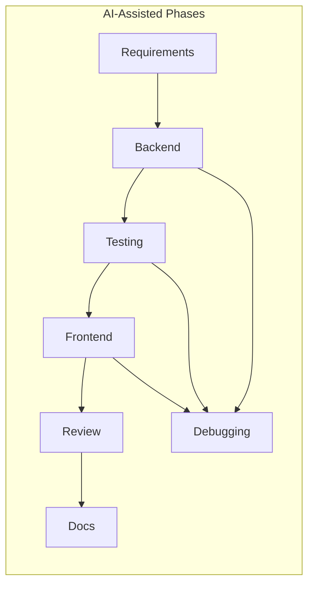

# AI Tool Workflow — Support Ticket Management System

Narrative of how **Cursor (Claude)** was used across the full development lifecycle — from requirements through implementation, testing, review, debugging, and evaluation documentation.

**Candidate:** Prashant Baliyan

**Related documents:**

- [submission-index.md](./submission-index.md) — assessor entry point
- [prompt-history.md](./prompt-history.md) — chronological prompt log (20 entries)
- [debugging-notes.md](./debugging-notes.md) — detailed issue investigations
- [code-review-notes.md](../../implementation-workflow/code-review-notes.md) — review findings
- [implementation-plan.md](../../implementation-workflow/implementation-plan.md) — milestones M0–M5
- [reflection.md](../../implementation-workflow/reflection.md) — lessons learned
- [cursor-rules-or-instructions.md](./cursor-rules-or-instructions.md) — AI guardrails

---

## 1. Tool & Setup

| Setting | Value |
|---------|-------|
| **IDE** | Cursor |
| **AI model** | Claude (inferred from artifact patterns) |
| **Workflow style** | Spec-first, milestone-gated pair programming |
| **Repository layout** | Monorepo — `backend/` (Express) + `frontend/` (React/Vite) |

### Context files loaded for AI sessions

Before implementation prompts, these workflow documents were referenced or attached:

| File | Role |
|------|------|
| [spec.md](./spec.md) | Canonical schemas, API paths, state machine transition table |
| [project-context.md](./project-context.md) | Stack, folder layout, conventions |
| [acceptance-criteria.md](./acceptance-criteria.md) | Definitions of done (AC-1–AC-11) |
| [tasks.md](./tasks.md) | Phased checklist — AI instructed to implement current phase only |
| [cursor-rules-or-instructions.md](./cursor-rules-or-instructions.md) | Mandatory guardrails (no secrets, minimal diffs, spec fidelity) |
| [api-contract.md](../../implementation-workflow/api-contract.md) | REST request/response schemas and error codes |

### Operating principle

AI was used as a **pair programmer**, not a one-shot code generator. Every AI output was validated against the spec, acceptance criteria, and test suite before acceptance. Prompts and outcomes are logged in [prompt-history.md](./prompt-history.md).

---

## 2. Lifecycle Phase Map



### Phase summary table

| Phase | Cursor mode | Key AI activity | Artifacts produced | Validation gate |
|-------|-------------|-----------------|-------------------|-----------------|
| **Requirements** | Plan | Generate spec-driven workflow docs, entity definitions, acceptance criteria | `spec.md`, `tasks.md`, `acceptance-criteria.md`, `project-context.md` | Spec review vs assessment brief |
| **Backend M1** | Agent | Mongoose models, Express scaffold, seed script, Docker Compose | `backend/src/models/`, `seed.js`, `docker-compose.yml` | `npm run seed`, `npm run dev` |
| **Backend M2** | Agent | REST routes, session auth, `ticketStateMachine.js`, validation middleware | `routes/`, `middleware/`, `services/ticketStateMachine.js` | Manual API testing |
| **Testing M3** | Agent | Vitest + Supertest setup, integration suites, transition matrix | `tests/integration/*.test.js`, `helpers.js` | `cd backend && npm test` |
| **Frontend M4** | Agent | React pages, API client, infinite scroll, status buttons | `frontend/src/pages/`, `api/client.js` | Manual walkthrough |
| **Review** | Ask / Agent | Compare routes against api-contract; security and spec alignment | [code-review-notes.md](../../implementation-workflow/code-review-notes.md) | Spec comparison + test re-run |
| **Debugging** | Agent | Diagnose entity mismatches, status smuggling, Supertest sessions, scroll duplicates | [debugging-notes.md](./debugging-notes.md) | Repro + `npm test` + manual UI check |
| **Documentation** | Plan + Agent | Evaluation docs, requirements analysis, reflection, submission index | `implementation-workflow/`, [submission-index.md](./submission-index.md) | Cross-link check, no placeholders |

Detailed prompts per phase: [prompt-history.md](./prompt-history.md)

---

## 3. How AI Was Used by Activity

### 3.1 Spec-first implementation

**When:** Before any new endpoint or feature.

**Process:**
1. Reference `api-contract.md` and `requirements-analysis.md` in the prompt.
2. Instruct AI to match request/response schemas exactly.
3. For status changes, require `ticketStateMachine.js` as the single enforcement point.

**Example prompt:**
> Implement `PATCH /api/v1/tickets/:id/status` per api-contract.md. Use `assertValidTransition` from ticketStateMachine.js. Return 409 with details.allowedTransitions on invalid transitions. Do not accept status changes on the generic PATCH endpoint.

**Outcome:** Dedicated status endpoint; generic PATCH rejects `status` field with `400`.

---

### 3.2 Scaffolding & boilerplate

**When:** Milestones M1–M2 (backend foundation and API).

**What AI generated:**
- Mongoose schemas with enums, validation, population refs
- Express route handlers with `express-validator` chains
- Seed script with idempotent user upsert and 15 sample tickets
- `ticketStateMachine.js` transition map and helper functions

**Human validation:** Compared model fields to `spec.md`; ran seed and dev server.

---

### 3.3 Test generation

**When:** After M2 API routes were stable.

**What AI generated:**
- `mongodb-memory-server` test setup
- Test helpers: `createUser`, `login`, `createTicket`, `setTicketStatus`
- Parameterized `it.each` for 5 allowed + 11 rejected state transitions
- Auth, CRUD, filter, pagination, and comment integration tests

**Validation gate:** `cd backend && npm test` — mandatory before proceeding to frontend.

---

### 3.4 Frontend implementation

**When:** Milestone M4 — after backend tests passed.

**What AI generated:**
- `api/client.js` with `credentials: 'include'` and `ApiError` class
- `AuthContext`, `ProtectedRoute`, login/list/create/detail pages
- Infinite scroll with `IntersectionObserver` on ticket list
- Dynamic status buttons from `meta.allowedTransitions`

**Refinement:** First pass hardcoded status buttons; review prompt led to dynamic rendering from API metadata.

---

### 3.5 Code review

**When:** After core features implemented, before sign-off.

**Review prompts used:**
1. *"Review `backend/src/routes/tickets.routes.js` against api-contract.md. List mismatches in status codes, error messages, or response shapes."*
2. *"Verify ticketStateMachine.js is the only module that determines allowed transitions."*
3. *"Check frontend/src/api/client.js for consistent error handling."*

**Accepted findings:** Status smuggling fix, standardized `409` with `allowedTransitions`, dynamic status buttons, comment `createdBy` population.

**Rejected suggestions:** JWT auth, Redis sessions, Zod, axios, embedded comments — documented in [code-review-notes.md](../../implementation-workflow/code-review-notes.md).

---

### 3.6 Debugging with AI

Four significant issues were diagnosed and fixed with AI assistance. Each is documented in [debugging-notes.md](./debugging-notes.md) and logged in [prompt-history.md](./prompt-history.md).

| Issue | AI role | Fix |
|-------|---------|-----|
| Entity field naming mismatch | Coordinated full-stack rename pass | `name`, `assignedTo`, Comment `message` |
| Status smuggling via generic PATCH | Split endpoints; add guard | Dedicated `PATCH /:id/status` only |
| Supertest 401 after login | Identified missing `request.agent()` | Standardized agent pattern in helpers |
| Infinite scroll duplicates | Suggested `loadingRef` guard | Synchronous guard + total-count check |

---

### 3.7 Evaluation documentation

**When:** Post-implementation, for assessment submission.

**Process:**
1. Generate docs from **actual codebase** — not aspirational designs.
2. Organize into `implementation-workflow/` and `tool-specific/cursor-workflow/`.
3. Cross-link all artifacts; populate [submission-index.md](./submission-index.md) as assessor entry point.

---

## 4. Key Design Decisions (with rationale)

| Decision | Rationale | AI involvement |
|----------|-----------|----------------|
| **Session auth** (`express-session` + cookies) | Assessment spec requires cookie-based sessions | AI suggested JWT — rejected |
| **Dedicated `PATCH /tickets/:id/status`** | Prevents status smuggling; auditable state machine gate | AI initially combined into generic PATCH — corrected |
| **Comments in separate collection** | Spec design; avoids document bloat | AI suggested embedding — rejected |
| **`409` for invalid transitions** (not `400`) | Distinguishes validation from business rule conflicts | AI aligned error codes to api-contract |
| **`meta.allowedTransitions` in responses** | UI renders only valid next-status buttons | Review prompt surfaced missing metadata |
| **Integration tests over unit tests** | Higher confidence for request → middleware → DB chain | AI generated integration matrix; unit tests planned as improvement |
| **Native `fetch` over axios** | No retry/interceptor requirements; fewer dependencies | AI suggested axios — rejected |
| **`express-validator` over Zod** | Already integrated; no new dependency | AI suggested Zod — rejected |

---

## 5. What AI Got Wrong (and how it was caught)

| AI mistake | How caught | Resolution |
|------------|------------|------------|
| Used `displayName`, `assignee`, embedded `body` | `npm test` failures + network tab inspection | Full-stack rename to spec fields |
| Generic PATCH accepted `status` | Manual curl + AC-6 review | Dedicated status endpoint + `400` guard |
| Bare `request(app)` in tests | 401 on authenticated endpoints | `request.agent(app)` in all test flows |
| Hardcoded status buttons | Code review prompt | Dynamic buttons from `allowedTransitions` |
| `IntersectionObserver` race | Manual repro with 15+ tickets | `loadingRef` synchronous guard |
| Over-engineering (JWT, Redis, Zod) | Scope check against spec | Rejected; documented in code-review-notes |

Full investigations: [debugging-notes.md](./debugging-notes.md)  
Lessons learned: [reflection.md](../../implementation-workflow/reflection.md)

---

## 6. Validation Gates

AI output was never merged without at least one verification step:

| Gate | When applied | What it caught |
|------|--------------|----------------|
| **`cd backend && npm test`** | After every backend change | Route bugs, validation gaps, state machine errors |
| **Manual API testing** | After new endpoints | Status smuggling, error response shapes |
| **Spec comparison** | Before accepting AI diffs | Field names, enums, transition graph, error messages |
| **Manual UI walkthrough** | After frontend changes | Scroll duplicates, status button visibility |
| **AC checklist** | Before sign-off | Coverage gaps across AC-1–AC-11 |
| **`git grep` for secrets** | Before commit | Ensured no `.env` or credentials in source |

**Rule applied:** Never accept AI-generated code without automated test or manual verification.

---

## 7. Reusable Prompt Templates

Templates that worked well on this project (reuse on similar full-stack assessments):

### Spec-first implementation
```
Implement [ENDPOINT] per api-contract.md. Use [SERVICE_MODULE] for business logic.
Return [STATUS_CODE] with [ERROR_SHAPE] on failure. Do not accept [FORBIDDEN_FIELD]
on the generic PATCH endpoint.
```

### Cross-file alignment
```
Align all models, routes, frontend pages, and tests to entity definitions in spec.md.
Update debugging-notes.md with any deviations before changing code.
```

### Test generation
```
Write integration tests in [TEST_FILE] for all [ALLOWED/REJECTED] transitions in
requirements-analysis.md. Each rejection must assert 409 and details.allowedTransitions.
Use request.agent(app) for authenticated flows.
```

### Review
```
Review [FILE] against api-contract.md. List mismatches in status codes, error messages,
or response shapes. Do not suggest new dependencies unless justified.
```

### Debugging
```
[Test/description] fails with [ACTUAL] instead of [EXPECTED]. Here is the test code
and route handler. Trace [REQUEST] → [MIDDLEWARE] → [SERVICE] → [DB] and find the gap.
```

---

## 8. Document Traceability Map

| Assessment concern | Primary evidence |
|--------------------|------------------|
| How was AI used? | This file + [prompt-history.md](./prompt-history.md) |
| Requirements before code? | [requirements-analysis.md](../../implementation-workflow/requirements-analysis.md) + [spec.md](./spec.md) |
| Acceptance criteria? | [acceptance-criteria.md](./acceptance-criteria.md) |
| Debugging with AI? | [debugging-notes.md](./debugging-notes.md) |
| Code review? | [code-review-notes.md](../../implementation-workflow/code-review-notes.md) |
| Trade-offs & reflection? | [reflection.md](../../implementation-workflow/reflection.md) |
| Test coverage? | [test-strategy.md](../../implementation-workflow/test-strategy.md) + `backend/tests/` |
| Run & verify? | [README.md](../../README.md) + [submission-index.md](./submission-index.md) |

---

## 9. Workflow Diagram (End-to-End)

```
Assessment brief
      │
      ▼
┌─────────────┐     Plan mode      ┌──────────────────┐
│  spec.md    │ ◄───────────────── │ Cursor: workflow │
│  tasks.md   │                    │ docs generation  │
│  AC docs    │                    └──────────────────┘
└──────┬──────┘
       │ Agent mode (M1–M2)
       ▼
┌─────────────┐     npm test       ┌──────────────────┐
│  Backend    │ ───────────────► │ Integration tests │
│  API + SM   │                    │ (mandatory gate)  │
└──────┬──────┘                    └──────────────────┘
       │ Agent mode (M4)
       ▼
┌─────────────┐     Manual         ┌──────────────────┐
│  Frontend   │ ───────────────► │ Walkthrough + AC   │
│  React SPA  │                    │ checklist          │
└──────┬──────┘                    └──────────────────┘
       │ Review + Debug prompts
       ▼
┌─────────────┐                    ┌──────────────────┐
│  Fixes +    │ ─────────────────► │ debugging-notes  │
│  refinements│                    │ prompt-history     │
└──────┬──────┘                    └──────────────────┘
       │ Documentation prompts
       ▼
┌─────────────────────────────────────────┐
│ submission-index + evaluation docs      │
└─────────────────────────────────────────┘
```

---

## 10. Improvement Backlog

Items identified during score-improvement planning (Workstream 3 pending):

- [ ] Unit tests for `ticketStateMachine.js` (pure function isolation)
- [ ] Edge-case integration tests: empty PATCH, invalid assignee, comment 404
- [ ] Frontend page tests (`TicketListPage`, `TicketDetailPage`)
- [ ] OpenAPI/Swagger from `api-contract.md` (optional polish)

Track progress in [submission-index.md § Improvement Status](./submission-index.md#improvement-status).
